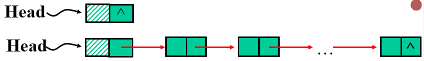

<!--
 * @Author: your name
 * @Date: 2021-06-15 16:40:29
 * @LastEditTime: 2021-06-17 00:46:32
 * @LastEditors: Please set LastEditors
 * @Description: In User Settings Edit
 * @FilePath: \Algorithm-learning\README.md
-->
# Algorithm-learning

## 递归

### 二叉树的遍历

```c++
void Traverse(Bitptr *t )
{     
      if (t!= NULL)
      {
            cout<<t->data;
            Traverse(t->lchild);
            Traverse(t->rchild);
       }
}
```

### 求链表最后一个元素

```c++
Typedef struct Link_list
{ 
       ElemType data;
       Link_list * next;
};
void search(Link_list *h)
{ 
       if (h->next == null)   
            cout<<h->data;
       else  search(h->next);
}
```
### 斐波那契数列
```c++
int Fibonacci(int n)
{
   if(n<2) return 1
   else
     {  f1=Fibonacci(n-1);
        f2=Fibonacci(n-2);
        f=f1+f2;
        return f;
     }
}
```

### 选择排序
``` c++
void SelectionSort (int i); 
{     if (i<n) 
      {   k = i; 
          for (j=i+1;j<=n; j++)
               if (A[j]<A[k])   k=j;
          if (k != i)   { temp=A[i]; A[i]=A[k]; A[k]=temp;}
          SelectionSort(i+1); 
   }   
} 

```
javascript版：
``` javascript
function SelectionSort(arr, i) {
    var len = arr.length;
    if (i == len) {
        return;
    }
    var str = "";
    if (i < len) {
        //找出第i+1个到第len个中最小的数的下标赋值给k
        var k = i;
        for (j = i + 1; j < len; j++) {
            if (arr[j] < arr[k]) {
                k = j;
            }
        }
        //如果k和i一样就不操作，否则交换，让第i始终比后面的数大
        if (k != i) {
            var temp = arr[i];
            arr[i] = arr[k];
            arr[k] = temp;
        }
    }
    console.log("数组为:")
    for (let i = 0; i < len; i++) {
        str = str + arr[i] + " ";
    }
    console.log(str);
    SelectionSort(arr, i + 1);
}
```

### 大整数的乘法
```c++
float Power(x,n)
{
    if(n==0){
        y=1;
    }
    else{
        y=Power(x,n/2);
        y=y*y;
        //如果n能被2整除  y=(2的二分之n次方)*(2的二分之n次方)
        //如果n不能被2整除  y=(2的二分之n次方)*(2的二分之n次方)*x
        if(n%2==1)
        {
            y=x*y;
        }
    }
    return y
}
```

### 生成全排列

```c++
void Permutatons(int n)
{
    //初始化p[],假如n=3,p=[1,2,3]
      for (j=1; j<=n; j++)
      {
          p[j]=j;
      }
      perm(1);
}    
void perm(int m);
{
       if (m==n)  
       { 
             for( j=1;j<=n; j++)
             {
                  cout<<p[j]<<endl;
             }
       }
      else
      {  
          for (j=m; j<=n; j++)
          {    
              temp=p[j]; p[j]=p[m]; p[m]=temp; 
              perm(m+1);
              temp=p[j]; p[j]=p[m]; p[m]=temp;
          }
     }
}    
```
javascript版
```javascript
var p = [null, 1, 2, 3];
var n = p.length;
var str = "";

function perm(m) {
    str = "";
    if (m == n) {
        for (var j = 1; j <= n-1; j++) {
            str += p[j];
        }
        console.log(str);
        str = "";
    } else {
        for (var j = m; j <= n-1; j++) {
            var temp = p[j];
            p[j] = p[m];
            p[m] = temp;
            perm(m + 1);
            temp = p[j];
            p[j] = p[m];
            p[m] = temp;
        }
    }
}
perm(1);
```
输出：
```
123
132
213
231
321
312
```
### 计算多项式

```c++
float Horner(A, float x)
//The input is a sequence of n+2 real numbers a0 ,a1 ,…,an and x 
{
      p=A[n];
      for (j=1; j<=n; j++)
           p=x*p+A[n-j];
      return p;
}    

```
## 分治

### 二分搜索
```javascript
var arr = [1, 3, 4, 5, 7, 9, 10, 22, 26],
    low = 0,
    high = arr.length + 1;
//二分搜索必须是有序数组
function BinarySearch(x, arr, low, high) {
    if (low > high) {
        console.log('无此数')
    } else {
        var mid = Math.floor((high + low) / 2);
        if (arr[mid] == x) {
            console.log(mid);
        } else if (arr[mid] < x) {
            BinarySearch(x, arr, mid + 1, high);
        } else {
            BinarySearch(x, arr, low, mid-1);
        }
    }
}
BinarySearch(1, arr, low, high);
BinarySearch(3, arr, low, high);
BinarySearch(4, arr, low, high);
BinarySearch(5, arr, low, high);
BinarySearch(7, arr, low, high);
BinarySearch(8, arr, low, high);
BinarySearch(9, arr, low, high);
BinarySearch(10, arr, low, high);
BinarySearch(26, arr, low, high);
```
输出：
```
0
1
2
3
4
无此数
5
6
8
```

### 归并排序
```javascript
var arr = [8, 4, 5, 7, 1, 3, 6, 2],
    i = 0,
    j = 7,
    temp = [];

function MergeSort(arr, temp, start, end) {
    if (start >= end) {
        return;
    }
    var len = end - start,
        mid = Math.floor(len / 2) + start,
        start1 = start,//左边部分的左下标
        end1 = mid,//左边部分的右下标
        start2 = mid + 1,//右边部分的左下标
        end2 = end;//右边部分的右下标
    MergeSort(arr, temp, start1, end1);//对左边部分进行分治排序
    MergeSort(arr, temp, start2, end2);//对右边部分再进行分治排序
    var k = start;//temp的下标

    //选择小的加入到temp
    while (start1 <= end1 && start2 <= end2) {
        temp[k++] = arr[start1] < arr[start2] ? arr[start1++] : arr[start2++];
    }
    while (start1 <= end1) {
        temp[k++] = arr[start1++];
    }
    while (start2 <= end2) {
        temp[k++] = arr[start2++];
    }

    //合并
    for (k = start; k <= end; k++) {
        arr[k] = temp[k];
    }
}
MergeSort(arr, temp, i, j);
console.log(arr);
//1,2,3,4,5,6,7,8
```